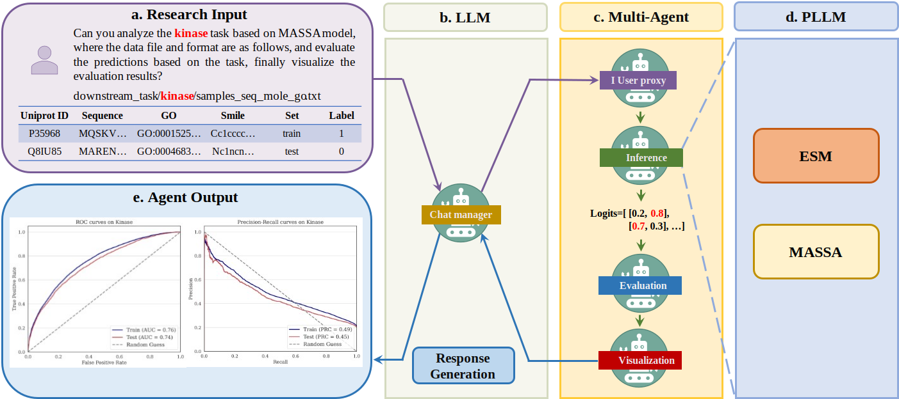

<div align="center">
<h2>ProtChat: An AI Multi-Agent for Automated Protein Analysis Leveraging GPT-4 and Protein Multimodal Model</h2>

<p align="center">
    
</p>

</div>


<p align="center" style="text-align:justify">
<strong>Abstract</strong>: Large language models (LLMs) have transformed natural language processing, enabling advanced human-machine communication. Similarly, in computational biology, protein sequences are interpreted as natural language, facilitating the creation of protein large language models (PLLMs). However, existing LLMs cannot perform specific protein tasks well, and applying PLLMs requires extensive preprocessing and tuning, creating a significant gap between these technologies. Here, we propose ProtChat, an AI multi-agent for protein analysis that integrates the predictive power of PLLMs with the conversational abilities of LLMs. ProtChat combines GPT-4 with the multimodal PLLM MASSA, automating tasks such as protein property prediction and protein-drug interactions. This AI agent allows users to input instructions directly, significantly improving efficiency and usability. Experiments demonstrate that ProtChat automates complex protein tasks with high accuracy, reducing manual intervention and increasing prediction speed. This advancement opens new research avenues in computational biology and drug discovery. Future applications may extend ProtChat's capabilities to broader biological data analysis. </p>

<p align="center"></p>

## Website

we have developed a [website](http://protchat-tool.online:8512) that allows users from any computer background to use it without the need to pay for a GPT-4 API Key. Future maintenance and updates shall follow this standard.

## Setup

Clone the repository and navigate into the directory:

```
git clone git@github.com:SIAT-code/ProtChat.git
cd ProtChat
```

## Installation

To use this project, do as the following to install the dependencies.

1. Create a new environment using: `conda create --name protchat python=3.9`.
2. Activate the environment you have just created: `conda activate protchat`.
3. Finally, run the following command to install the required packages inside the conda environment:

```commandline
pip install -r requirements.txt
```

## Dataset

You can download the datasets
from [this](https://drive.google.com/file/d/1SyYiE0XWZBZPQ4bjZntyWPK0BUCJ8p_d/view?usp=sharing)
link, which provides some samples. The directory of data files like the following:

```yaml
| -- downstream_task
|    |-- stability
|    |-- fluorescence
|    |-- remote_homology
|    |-- secondary_structure
|    |-- antigen_binding
|    |-- pdbbind
|    |-- kinase
|    |-- skempi
```

All the datasets that we used in the project can be found in the datasets folder. They are preprocessed and ready to
use.You can use them directly.

## Checkpoints
We have prepared model checkpoints for direct inference. Please refer to [this](https://drive.google.com/file/d/1-6gEmPm-JojQSV0ST0lWzchWQe-j-CWR/view?usp=sharing) link. The directory of the checkpoint files is as follows:
```yaml
| -- checkpoints
|    |-- stability
|    |-- fluorescence
|    |-- remote_homology
|    |-- secondary_structure
|    |-- antigen_binding
|    |-- pdbbind
|    |-- kinase
|    |-- skempi
|        |-- fold1
|        |-- fold2
          ...
|        |-- fold10
```

## Inference

Please refer to [AutoGen-MASSA.ipynb](./scripts/AutoGen-MASSA.ipynb) for the inference code, the dialogue template for the agent is as follows:
```python
user_proxy.initiate_chat(manager, message="""Can you analyze on kinase task which belongs to protein-drug interaction prediction benchmark, where the data file and format are as follows, and evaluate the predictions based on the task, finally visualize the evaluation results?

downstream_task/kinase/samples_seq_mole_go.txt

Start the work now.
""")
```

## Fine-tune

If you wish to perform fine-tuning, please refer to the [AutoGen-MASSA.ipynb](./scripts/AutoGen-MASSA.ipynb) as well, the dialogue template for the agent is as follows:
```python
user_proxy.initiate_chat(manager, message="""Can you fine-tune and analyze on antigen binding task which belongs to protein property prediction benchmark, where the data file and format are as follows, and evaluate the predictions based on the task, finally visualize the evaluation results?

downstream_task/antigen_binding/sequence_go.txt

Start the work now.
""")
```